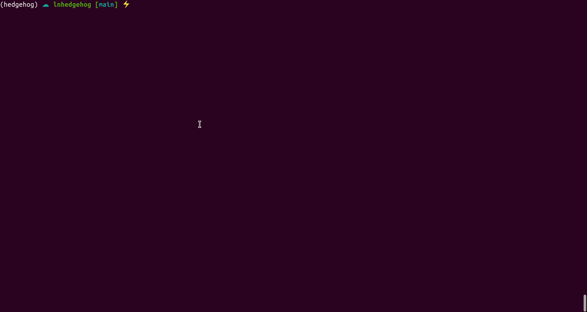

## LN Hedgehog 🦔⚡

Locking in a fiat value of your lightning wallet balance whilst earning interest using the Kollider api.

#### Whats the point?

Locking up Bitcoin in lightning channels is fine as long as the market goes up. However, as soon as the Bitcoin price starts to go sideways or even down the cost of capital is usually higher than your return. In these times you ideally want to be able to 

1. Earn interest on your locked Bitcoin
2. Protect yourself from dowside risk (market going down)

This is what LN Hedgehog trying to achieve.

#### How does it work?

In a nutshell Ln Hedgehog looks at your channel balances and automatically short sells Bitcoin against the fiat currency of your choice (currently only USD). This means that the value **in fiat terms** of your channel balances will always be the same no matter whether Bitcoin goes up or down. You might be thinking now that in order to do that you would need to lock up your entire channel balance on Kollider, which means you cannot spend your lightning Bitcoin. Fortunately this is not the case because derivatives enable you trade in a much more capital efficient way through the concept of **leverage**. For example, by default Hedgehog uses 10% of your balance to perform the hedging trade which leaves you with 90% of your lightning bitcoin free to spend. Now as soon as you spend or receive payments, LN Hedgehog will automatically reblance your position so that your entire balance is locked.

Furthermore, since hedging is done through a perpetual swap contract where interest rates are exchange between buyers and sellers every 8h, Hedgehog can accumulate interest on your locked balance. However, in times where there is significant downwards pressure this hedging strategy will become more expensive.

#### Cool but why not Stablecoin?

The most obvious question that arises is, why can't you buy a stable coin instead? Well you can but its slow and expensive. Imagine you have a lightning wallet and you want to buy tether? You would need to use a serivce like FixedFloat to do that. Currently the exchange would cost you about 34% in fees. Nevertheless while this is currently a compelling argument fees might decrease in the future. Regardless, the main assumption this stands on is that making any transaction on layer 1 will always be slower and more expensive. I assume that the only superior solution to this would be if the stable coin itself is transacted on the second layer.

## Demo
This demo shows how one can lock in a USD price for 0.5% of their lightning channel balance in seconds.



## Installation
#### Install LND dependencies
```shell
bash install_lnd_deps.sh
```
This will install the python libraries required to commuincate to the LND RPC as well as download and compile the lates protobuf files from LND.

#### Installing Kollider dependencies

```shell
git clone https://github.com/kolliderhq/kollider-api-client.git
cd kollider_api_client
pip install -e .
```

## Configuration

In order to run Hedgehog you'll need:

1. A Kollider API key
	- To get an API key you have to register at https://pro.kollider.xyz. We support LnAuth so you can stay icognito. 
2. The admin.macaroon of your node
3. The tls.cert of your node

There is a `sample.config.json` in this directory which you can use as a starting point. Change the name to make the scirpt use it.
```
mv sample.config.json config.json
```
#### Config Parameters
```yml

api_key: Your Kollider api key
api_secret: Your Kollider api secret
api_passphrase: Your kollider api passphrase
ws_url: Websocket URL to the Kollider API
lnd_url: URL to your lightning node 
admin_macaroon_path: Path to your admin.macaroon file.
tls_path: Path to your tls cert.
hedge_proportion: How much of your balance do you want to hedge, e.g. 0.01 = 1%
hedge_side: The side you want to hedge. If your hedging your channel balance it should be `Bid`
target_base_currency: Currency you want to hedge i.e. BTC
target_fiat_currency: Currency youu want to hedge agains i.e. USD
target_index_symbol: The kollider index price symbol for the pair in question.
target_symbol: The Kollider symbol for the contract that is used to do the hedge.
target_leverage: The leverage the hedge should be using.
cycle_speed: How often should the program revaluate the position.
order_type: What order type should the hedging programing use. Market | Limit


```

## Run

#### Run Server

This will run the ln hedgehog server.

```shell
python main.py
```

#### Run Cli

```shell
./cli.py --help
./cli.py --wallet_info
./cli.py --node_info
./cli.py --set_lock_proportion 0.5
```

Setting lock proportion determins how much of your balance will be locked against USD. Afer you run this command you can run

```shell
./cli.py --lock_status
```

The response will show you whether the balance is locked or not.

## Potential Application

- Reducing FX risk for merchants that accept Bitcoin Lightning payments. 
- Wallets can offer this to their users as feature to decrease volatility. 
	- [x] Peg Balance against USD
- Wallets can offer this to their users to earn yield on their Bitcoin.
- Others? 

## ⚠️ Warning

This is still under construction and shall not be used in production. **DO NOT USE IN PRODUCTION**
